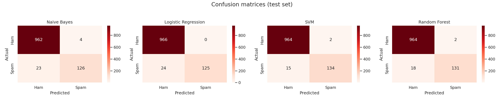
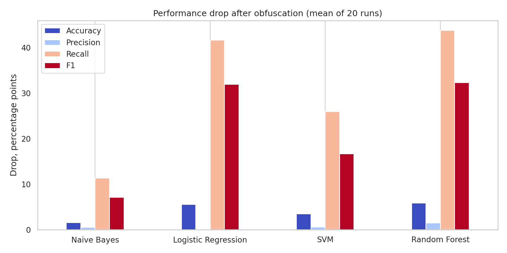

# SMS Spam Detection: classical ML and robustness to obfuscation

Four classical classifiers — Naive Bayes, Logistic Regression, linear SVM and Random Forest — trained on TF-IDF features
of the [SMS Spam Collection](https://archive.ics.uci.edu/dataset/228/sms+spam+collection), followed by an adversarial test in which
spam messages are obfuscated with look-alike characters (`free → fr33`, `call → c@ll`).

The full experiment is in one notebook: [`ML_Spam_Detector.ipynb`](ML_Spam_Detector.ipynb) A write-up is in paper/..
## Results

Stratified 80/20 split (1,115 test messages, 149 spam), seed 42. Precision / recall / F1 are for the spam class.

| Model | Accuracy | Precision | Recall | F1 | ROC-AUC |
|---|---|---|---|---|---|
| Naive Bayes | 0.976 | 0.969 | 0.846 | 0.903 | 0.984 |
| Logistic Regression | 0.979 | 1.000 | 0.839 | 0.912 | 0.990 |
| **SVM (linear)** | **0.985** | 0.985 | **0.899** | **0.940** | **0.990** |
| Random Forest | 0.982 | 0.985 | 0.879 | 0.929 | 0.988 |

**Adversarial test.** Letters in the spam messages of the test set are replaced by look-alike symbols with probability 0.3
(models are not retrained). The perturbation is random, so it is repeated 20 times; the table shows the mean.

| Model | Recall clean → adv. | F1 clean → adv. | F1 drop (points) |
|---|---|---|---|
| **Naive Bayes** | 0.846 → 0.733 | 0.903 → 0.833 | **7.1** |
| SVM (linear) | 0.899 → 0.640 | 0.940 → 0.774 | 16.7 |
| Logistic Regression | 0.839 → 0.423 | 0.912 → 0.594 | 31.9 |
| Random Forest | 0.879 → 0.442 | 0.929 → 0.607 | 32.3 |

The SVM is the best model on clean data, but Naive Bayes is the most robust to obfuscation. Precision barely changes
(only spam is modified, so the extra errors are missed spam).




All numbers are also saved in [`results/`](results/) (CSV / JSON), all plots in [`figures/`](figures/).

### Caveats

- The dataset contains 403 exact duplicate messages that can land on both sides of the split. After removing them
  (5,171 messages) F1 becomes 0.880 (NB), 0.846 (LR), 0.913 (SVM), 0.914 (RF) — SVM and Random Forest are practically tied.
  This check is the last section of the notebook.
- No cross-validation and no hyperparameter search; one substitution scheme for the adversarial test.
- TF-IDF is fitted on the training set only (inside a scikit-learn `Pipeline`), so there is no vocabulary leakage from the test set.

## Repository layout

```
ML_Spam_Detector.ipynb   experiment (run top to bottom, outputs included)
data/smshamspam.csv      dataset: columns `sms`, `label` (0 = ham, 1 = spam)
results/                 metric tables and confusion matrices (CSV / JSON)
figures/                 plots produced by the notebook
paper/    write-up (docx and pdf)
requirements.txt
```

## Run it

```bash
git clone https://github.com/altynbk/sms-spam-detection.git && cd sms-spam-detection
python -m venv .venv && source .venv/bin/activate      # optional
pip install -r requirements.txt
jupyter notebook ML_Spam_Detector.ipynb
```

Run from the repository root (the notebook reads `data/smshamspam.csv`). On Google Colab: `!git clone https://github.com/altynbk/sms-spam-detection.git`, `%cd sms-spam-detection`, `!pip install -q wordcloud`, then run all cells. Trained pipelines are written to `models/` (git-ignored).
Everything is seeded, so results are reproducible.

## Data

SMS Spam Collection: T. A. Almeida, J. M. Gómez Hidalgo, A. Yamakami, *Contributions to the study of SMS spam filtering:
new collection and results*, ACM DocEng 2011. Dataset page: <https://archive.ics.uci.edu/dataset/228/sms+spam+collection>
(CC BY 4.0).
