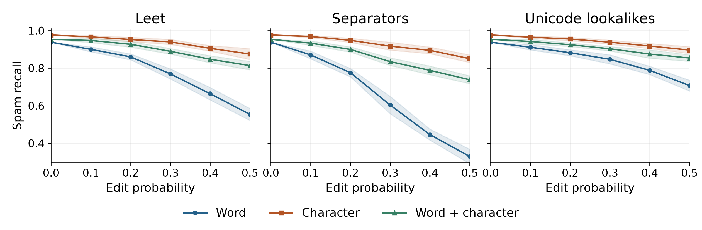

# SMS Spam Detection

[](https://github.com/altynbk/sms-spam-detection/actions/workflows/tests.yml)

A reproducible study of classical text classifiers on the historical English
[SMS Spam Collection](https://archive.ics.uci.edu/dataset/228/sms+spam+collection),
with an interactive lab for exploring predictions and character-level attacks.

Eleven variants share grouped train/validation/test splits. Training
cross-validation chooses the model; validation sets its threshold; held-out data
measure clean and attacked performance. Labels are **ham = 0, spam = 1**.

## Results at a glance

The selected word TF-IDF LinearSVC, using its frozen validation threshold:

| Measure | Default protocol |
|---|---:|
| Spam precision / recall / F1 | 0.9683 / 0.9385 / **0.9531** |
| False positives / legitimate messages | **4 / 904** |
| False negatives / spam messages | **8 / 130** |
| Conditional 95% group-bootstrap F1 interval | 0.9249–0.9769 |
| Mean spam recall under separators, probability 0.3 | **0.6035** |

A training-majority baseline achieves 87.43% accuracy but detects no spam.
Character features retain more recall under the tested edits, with different
false-positive costs. An exploratory template-grouped experiment and conditional
intervals qualify the findings. These results do not establish performance on
modern SMS, Russian/Kazakh or production traffic.



The figure compares three LinearSVC feature sets at their own fixed validation
thresholds; clean false-positive rates differ. Bands show attack-seed variability.
See the [complete protocol and tables](docs/PROTOCOL.md) for both decision rules,
all eleven variants and the limits of these comparisons.

## Start here

- [Paper (PDF)](paper/SMS_Spam_Detection_Paper.pdf) · [Editable manuscript](paper/SMS_Spam_Detection_Paper.docx)
- [Executed notebook](ML_Spam_Detector.ipynb) — analysis, figures and error examples.
- [Model card](docs/MODEL_CARD.md) — intended use, measured quality and limitations.
- [Validation](docs/VALIDATION.md) — completed checks and reproducible commands.
- [Development](CONTRIBUTING.md) · [Research priorities](docs/ROADMAP.md)

## Install

Run from this repository's root using **Python 3.12**. If the local environment
already exists, activate it and skip its creation.

```bash
python3.12 -m venv .venv
source .venv/bin/activate
python -m pip install -r requirements.txt
python -m pytest -q
```

Dependencies are pinned. Local validation used Python 3.12.14 on macOS arm64;
GitHub Actions checks Python 3.12 on Ubuntu and macOS.

## Interactive demo

Install the optional application dependencies and launch:

```bash
python -m pip install -r requirements-app.txt
python -m streamlit run app.py
```

Open [SMS Spam Lab](http://127.0.0.1:8501). Its four tabs provide:

- **Check a message:** Spam/Ham with exact LinearSVC feature contributions.
- **Attack playground:** reproducible edits and before/after predictions.
- **Results explorer:** saved metrics, intervals and attack curves.
- **About:** data, evaluation scope and limitations.

The default report is `results/full`. Its saved tables work immediately; model
binaries are intentionally excluded from Git. To enable predictions after a fresh
clone, create the full run in the next section, then launch against it:

```bash
SMS_SPAM_RUN=results/local/full python -m streamlit run app.py
```

The app never trains on startup. It checks the selected model's recorded hash,
versions, identity and threshold before loading. Use trusted local artifacts;
hashes detect changes, not malicious authors. SVM margins are not confidence
percentages. Blank/OOV input receives a prompt; the playground limits source text
to 2,500 characters to leave room for inserted separators.

Messages remain in session memory without application logging, cross-user
prediction caching or an external prediction service. The default server binds
to localhost and disables usage telemetry. A hosted server would receive input.

## Reproduce the experiments

New runs belong under ignored `results/local/`. Training refuses to overwrite a
nonempty directory; choose a new run name when repeating a command.

```bash
# Smoke check: 11 variants, one candidate each, 5 folds and 264 attack rows.
python -m spam_detector.train --mode quick --jobs 2 --output results/local/quick
python scripts/verify_results.py --run results/local/quick --all-attacks

# Full study: 84 candidates, 420 CV fits and 7,920 attack rows.
python -m spam_detector.train --mode full --jobs 2 --output results/local/full
python scripts/verify_results.py --run results/local/full --all-attacks
python -m spam_detector.uncertainty --run results/local/full

# Exploratory template sensitivity: a separate full search and split.
python -m spam_detector.train --mode full --grouping template --jobs 2 --output results/local/template
python scripts/verify_results.py --run results/local/template --all-attacks
python -m spam_detector.uncertainty --run results/local/template
```

Defaults: seed 42, validation/test fractions 0.2/0.2, empirical validation FPR
limit 0.01. Use `--jobs 1` for less parallelism. The quick run is a smoke check.
Committed full results remain in [results/full](results/full) and
[results/template](results/template). Verification needs the matching local
models; interval calculation needs only the committed prediction/error tables.

To explore the executed report:

```bash
python -m pip install -r requirements-notebook.txt
python -m jupyterlab ML_Spam_Detector.ipynb
```

The notebook reads committed results and works without model binaries. Its
optional inference cell explains how to prepare them. Change `RUN` to
`Path("results/local/full")` to inspect your reproduced run.

## Use the saved model

After training, run from the repository root:

```python
from spam_detector.demo import load_verified_model

model = load_verified_model("results/local/full")
messages = ["FREE entry! Call NOW to claim £100", "Are we meeting for lunch?"]
print(model.predict(messages))           # frozen validation threshold
print(model.score(messages))             # continuous scores
print(model.pipeline.predict(messages))  # native classifier decisions
```

The saved pipeline accepts original SMS strings and includes preprocessing.
See the [input contract](docs/MODEL_CARD.md#model-and-decision-rule).

## Repository layout

| Path | Purpose |
|---|---|
| `spam_detector/` | Data checks, grouped evaluation, training, inference and attacks |
| `app.py` | Local interactive demonstration |
| `tests/`, `.github/workflows/tests.yml` | Regression checks and CI |
| `data/smshamspam.csv` | Bundled public corpus |
| `results/full/`, `results/template/` | Published tables, manifests, figures and provenance |
| `results/local/` | Ignored outputs from new local runs |
| `ML_Spam_Detector.ipynb` | Executed research report |
| `paper/`, `scripts/build_paper*.py` | Current manuscript and its table/figure builders |
| `docs/` | Protocol, model card, validation, references and original audit |
| `results/historical/`, `figures/historical/` | Original evidence, excluded from current model selection |

The [original audit](docs/AUDIT.md) and
[reference comparison](docs/REFERENCE_COMPARISON.md) explain methodological
decisions. Historical and current results use different protocols and are not a
controlled before/after comparison.

## Rebuild the paper

```bash
python -m pip install -r requirements-paper.txt
python scripts/build_paper_figures.py
python scripts/build_paper.py
```

Export the DOCX to `paper/SMS_Spam_Detection_Paper.pdf` with Word or LibreOffice
and inspect every page. The builders use the committed experimental tables.

Project code: [MIT](LICENSE). Dataset: [CC BY 4.0, UCI DOI 10.24432/C5CC84](https://doi.org/10.24432/C5CC84).
The [protocol](docs/PROTOCOL.md#data-preparation-and-evaluation-protocol) records
the bundled CSV's provenance and hash.
