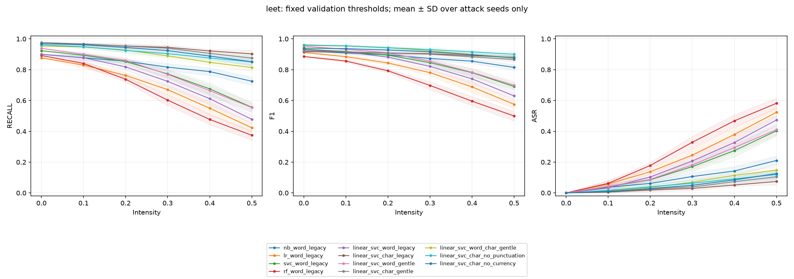
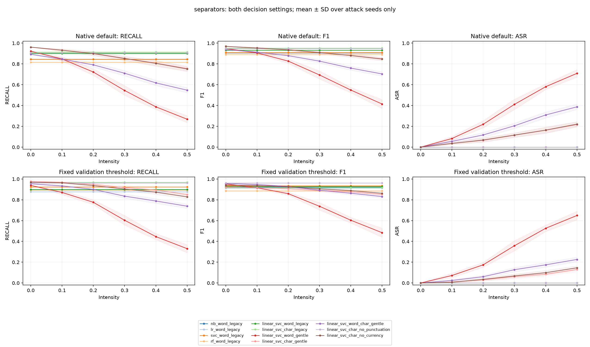
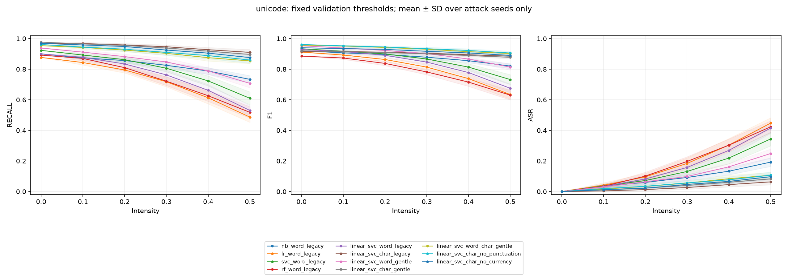

# Experiment protocol and results

Detailed methodology for the published default and exploratory template runs.
For installation, the demo and reproduction commands, see the [README](../README.md).

## Data preparation and evaluation protocol

The bundled `data/smshamspam.csv` has columns `sms,label`, with 5,574 rows.
Source: T. A. Almeida, J. M. Gómez Hidalgo and A. Yamakami, *Contributions to the
study of SMS spam filtering: new collection and results*, DocEng 2011.
[UCI / DOI 10.24432/C5CC84](https://doi.org/10.24432/C5CC84), CC BY 4.0.
Project code is MIT licensed. SHA-256 of this specific repository CSV:

```text
bbcb13af6558d89e007094a1d62a982ce2b03ce679f89cd88625de3c71cea76a
```

Before splitting, validate text types, blank values, labels and conflicting labels
for exact or normalized messages. Conflicts raise a diagnostic `ValueError` with
source row identifiers; labels are never silently chosen.

Remove 403 exact duplicate rows, retaining original strings: **5,171 messages
(4,518 ham / 653 spam)**. There are no label conflicts. Normalize grouping keys using
lowercase, trim and whitespace collapse only; preserve punctuation and Unicode.
This gives 5,159 groups, including 12 groups of two distinct raw texts each.

Stratify **unique homogeneous groups**, first holding out 20% test (seed 42), then
25% of the remainder for validation (seed 43). Assign all members to their group's
split. Fractions apply to groups and are approximate by row count.

| Split | Messages | Ham | Spam | Purpose |
|---|---:|---:|---:|---|
| Train | 3102 | 2710 | 392 | Cross-validation and fitting |
| Validation | 1035 | 904 | 131 | Threshold selection only |
| Test | 1034 | 904 | 130 | Final clean and attacked evaluation |

[The split manifest](../results/full/splits.csv) records raw-text hashes, normalized
group hashes, labels, split, CV fold and all original `source_rows` (zero-based,
excluding the CSV header). No raw or normalized group crosses splits.
Five shared `StratifiedGroupKFold` folds inside train use seed 42. Every fold fits
its own vocabulary and IDF inside its pipeline. Group stratification only approximates
class balance by message count.

## Sensitivity to message templates

The default grouping keeps case/whitespace variants together. A deterministic
extension, `--grouping template`, also masks URLs and digit sequences in normalized
messages longer than 30 characters. Short messages retain their original keys.
This key is used for both holdout splitting and CV; the classifier still receives
the original SMS. Conflicting labels in a template group raise an error.

The default split contains **13 templates across splits (31 messages)**, including
**6 test messages with a training-template counterpart**. The template split has
**zero overlaps under this rule** and 5,137 groups. Its train/validation/test sizes
are 3,095/1,040/1,036. Each run exports a reproducible `template_overlap.json` report
with hashes and source row identifiers; it does not export additional message text.

```bash
python -m spam_detector.train --mode full --grouping template --jobs 2 --output results/local/template
python scripts/verify_results.py --run results/local/template --all-attacks
```

The [template experiment](../results/template/selection.json) repeats the full search
on its own training folds and selects `linear_svc_char_no_punctuation`. Native
predictions yield F1 **0.9531**, 2 FP and 10 FN. Its validation-selected threshold
yields F1 **0.9288**, 11 FP and 8 FN, with test FPR **1.22%**. The empirical 1%
validation constraint does not guarantee the same rate on test.

This is an exploratory sensitivity analysis added after inspecting the original
experiment. Membership, fitted models and the selected variant all change, so the
F1 difference is not a causal estimate of duplicate leakage. The default choice
remains frozen. The heuristic does not identify every paraphrase or campaign;
an independent modern-data benchmark remains necessary for transfer claims.

## Controlled comparisons and selection

- **Classifiers:** original NB (alpha), LR (C/class_weight), linear-kernel SVC
  (C/class_weight), RF (100 trees, max_depth/min_samples_leaf), with legacy cleanup
  and word features.
- **Features:** one LinearSVC and gentle cleanup, comparing word TF-IDF (1–2 grams),
  char_wb TF-IDF (3–5 grams), and their FeatureUnion. Same folds and C=0.5/1,
  class_weight=None/balanced grid. Total max_features is 1,000/5,000, split equally
  between union branches with equal weights and joint L2 normalization.
- **Preprocessing:** legacy exactly reproduces lowercase plus removal of
  `[^a-z0-9\s]`; gentle only changes case/whitespace. Both have word and char
  variants. Additional char ablations remove Unicode punctuation (P*) or currency
  symbols (Sc). The notebook also pairs CV rows at identical hyperparameters.

A word tokenizer itself excludes much punctuation; preserving symbols during cleanup
alone does not ensure word features contain them. Character features are a tested
hypothesis, not a guarantee of better accuracy or robustness.

[All parameter grids and fitted settings](../results/full/metadata.json) and
[every candidate/fold score](../results/full/cv_results.csv) are saved.
Primary criterion: mean spam-class F1 under **native classifier predictions** on
train-CV. Select the highest mean score; exact ties use alphabetical model_id order.
Best searched CV scores are optimistic, not independent final estimates.
Test does not select models, features, preprocessing, parameters, thresholds or defenses.
[selection.json](../results/full/selection.json) is written before test scoring.

## Validation-only thresholds

Compare native `pipeline.predict` decisions against a validation-selected threshold:
maximize recall subject to empirical FPR ≤ `max_fpr`; ties prefer fewer FP, then a
higher threshold. The tuned rule is **score ≥ threshold predicts spam**.
The default setting uses the estimator's own tie-breaking (including probability=0.5),
consistent with CV. Nominal defaults are 0.5 for probabilities and 0 for margins.
SVC/LinearSVC `decision_function` outputs are scores, **not probabilities**.

With 904 validation ham messages, one FP changes FPR by 1/904 ≈ 0.11 percentage
points; at most 9 FP satisfy the 1% limit. This is an empirical validation constraint,
not a statistical guarantee on test or future traffic. Thresholds are saved with
models and in metadata, and held fixed for clean/attacked test. **No model is
refitted after threshold selection.** ROC-AUC/AP use continuous scores.

## Actual full-run results

Seed 42; test = 904 ham / 130 spam. Precision, recall and F1 concern spam.
Default and tuned settings use the same fitted model. FP counts blocked legitimate
messages; FN counts missed spam.

As a class-imbalance reference, a `DummyClassifier(strategy="prior")` learns the
majority and class prior from **train only**, then always predicts ham here:
**87.43% test accuracy, 0 spam recall/F1, 0 FP and 130 FN**. See
[baseline_metrics.csv](../results/full/baseline_metrics.csv). This no-text reference
is excluded from the 11-model search and threshold selection.

| Model / features / cleanup | Best CV F1* | Test F1: default → tuned | Tuned precision | Tuned recall | Tuned FP / FN | Tuned FPR |
|---|---:|---:|---:|---:|---:|---:|
| NB / word / legacy | 0.9099 | 0.9053 → 0.9213 | 0.9435 | 0.9000 | 7 / 13 | 0.77% |
| LR / word / legacy | 0.9111 | 0.9035 → 0.9120 | 0.9500 | 0.8769 | 6 / 16 | 0.66% |
| SVC / word / legacy | 0.9249 | 0.9091 → 0.9339 | 0.9449 | 0.9231 | 7 / 10 | 0.77% |
| RF / word / legacy | 0.8707 | 0.8908 → 0.8855 | 0.8788 | 0.8923 | 16 / 14 | 1.77% |
| LinearSVC / word / legacy | 0.9283 | 0.9323 → 0.9286 | 0.9590 | 0.9000 | 5 / 13 | 0.55% |
| LinearSVC / char / legacy | 0.9407 | 0.9520 → 0.9164 | 0.8690 | 0.9692 | 19 / 4 | 2.10% |
| **LinearSVC / word / gentle (CV choice)** | 0.9460 | 0.9486 → 0.9531 | 0.9683 | 0.9385 | 4 / 8 | 0.44% |
| LinearSVC / char / gentle | 0.9433 | 0.9690 → 0.9203 | 0.8699 | 0.9769 | 19 / 3 | 2.10% |
| LinearSVC / word+char / gentle | 0.9435 | 0.9393 → 0.9575 | 0.9612 | 0.9538 | 5 / 6 | 0.55% |
| LinearSVC / char / no punctuation | 0.9409 | 0.9478 → 0.9615 | 0.9615 | 0.9615 | 5 / 5 | 0.55% |
| LinearSVC / char / no currency | 0.9434 | 0.9690 → 0.9403 | 0.9130 | 0.9692 | 12 / 4 | 1.33% |

*Best CV F1 is after search, not an independent estimate. Accuracy, ROC-AUC, average
precision, confusion matrices, counts and FPR for **both** settings are in
[clean_metrics.csv](../results/full/clean_metrics.csv); validation is reported
[separately](../results/full/validation_metrics.csv).

CV selected **linear_svc_word_gentle**, even though some alternatives score higher
on test under particular thresholds. Its tuned threshold is −0.08620419778818611:
precision 0.9683, recall 0.9385, F1 0.9531, accuracy 0.9884, ROC-AUC 0.9957,
AP 0.9817; confusion matrix `[[900, 4], [8, 122]]`. Native default: 3 FP / 10 FN,
F1 0.9486. Tuning trades one additional FP for two fewer FN on this test.

Tuning **reduced** test F1 for several variants. Char legacy/gentle reached
19/904=2.10% test FPR, RF 16/904=1.77%, and char without currency signs 12/904=1.33%.
Thresholds were not adjusted to repair these test outcomes. The objective constrains
validation FPR and maximizes recall, not test F1; small validation samples and differing
empirical score distributions can produce worse test tradeoffs.

### Conditional uncertainty

For the frozen selected model, a class-stratified bootstrap resamples entire test
groups with replacement (5,000 draws, seed 42). The 95% percentile interval for
validation-threshold F1 is **0.9249–0.9769** in the default protocol and
**0.8968–0.9586** in the exploratory template protocol. These are different test
sets, so overlapping intervals are not a paired significance test.

```bash
python -m spam_detector.uncertainty --run results/full
python -m spam_detector.uncertainty --run results/template
```

This command reconstructs predictions from the saved complete error ledger,
checks them against the confusion counts, and records input hashes. It requires
no model files or retraining. Each run's `confidence_intervals.csv` reports
precision, recall, F1 and FPR for both decision rules. The intervals condition on
the fitted model, split and observed class/group composition; they exclude
training/search variability and domain shift. Rare errors can yield discrete or
degenerate intervals. They are separate from the attack-seed standard deviations.

## Robustness evaluation

Attacks modify **raw spam**, which then passes through the full pipeline. Ham is
unchanged. Every model receives the same set for `(attack_type, intensity, seed)`.
[Attack manifests](../results/full/attack_manifest.csv) record each set's hash and
numbers of changed ham/spam messages.

| Scenario | Rule | Meaning of intensity |
|---|---|---|
| Leet | a→@/4, e→3, i→1/!, o→0, s→$/5, l→1, t→7, c→(/<, u→v, b→8; uppercase supported; unrelated characters unchanged | Replacement probability per eligible ASCII letter |
| Separators | Insert '.', '-' or '_' between adjacent ASCII letters; retain all original characters | Insertion probability per eligible boundary |
| Unicode | Fixed case-aware Latin-to-Cyrillic lookalike table; other characters unchanged | Replacement probability per eligible character |

Intensities: 0.0, 0.1, 0.2, 0.3, 0.4, 0.5. Twenty seeds: 10042–10061.
There are **360 attack datasets and 7,920 metric rows** (11 models × 2 decisions).
Intensity is not the fraction of all changed characters, and eligible positions
vary by scenario. Human readability and semantic preservation are not evaluated.

ASR = clean-correct spam that becomes missed after attack / clean-correct spam.
With a zero denominator it is undefined: Python None/JSON null, `undefined` in CSV.
Numerator and denominator are retained. All draws and mean/SD summaries are saved:
[raw runs](../results/full/robustness_runs.csv), [summary](../results/full/robustness_summary.csv).

Gentle cleanup + LinearSVC, intensity 0.3, means over 20 seeds. Each model retains
its own fixed validation threshold:

| Attack | Word: recall / F1 / ASR | Char: recall / F1 / ASR | Word+char: recall / F1 / ASR |
|---|---:|---:|---:|
| leet | 0.7696 / 0.8547 / 0.1820 | 0.9400 / 0.9011 / 0.0390 | 0.8900 / 0.9230 / 0.0698 |
| separators | 0.6035 / 0.7376 / 0.3582 | 0.9173 / 0.8890 / 0.0614 | 0.8350 / 0.8913 / 0.1278 |
| unicode | 0.8473 / 0.9021 / 0.0984 | 0.9385 / 0.9003 / 0.0398 | 0.9035 / 0.9304 / 0.0552 |

Character features lose less recall here, but their tuned threshold also produces
more clean false positives. This is not unconditional superiority. Native-default
comparisons are available in the same CSV. The CV choice is unchanged after attacks.
Legacy/no_punctuation remove the inserted '.', '-' and '_', so this particular
separator attack is neutralized for those variants; it is not a general defense.





Each figure shows native decisions in the top row and fixed validation thresholds
in the bottom row. All 11 models use distinct, consistent colors; neither row holds
test FPR equal across models. Bands show ±1 SD over **random perturbations only**. They exclude new splits,
parameter selection and refitting, and do not quantify overall model uncertainty.

## Provenance and independent verification

[metadata.json](../results/full/metadata.json) records Python/library versions, platform,
seed/split settings, dataset source/hash, base commit and dirty flag, source hashes,
configuration, all fitted parameters, CV selection, thresholds and artifact hashes.
`working_tree_dirty=true` identifies local modifications; it is not a fabricated new
commit ID. Evaluation revision 2 uses native default predictions, correcting an exact
RF tie from the initial implementation without changing tuned thresholds or selection.

[verification.json](../results/full/verification.json) records the actual scope of independent
recomputation. `--all-attacks` recomputes every one of the 7,920 rows by feeding complete
raw attacked sets through loaded pipelines, without the training runner's ham-score cache.
It also checks all validation/error rows, baseline results, CV aggregates and
robustness summaries, including missing/duplicate/unexpected scenario keys. It does
not refit text models or change parameters based on test outcomes. The dummy reference
uses training label counts only.

[errors.csv](../results/full/errors.csv) contains raw text, truth, prediction, score and
FP/FN type for each model/decision setting. Raw text is exported by default only for
the recognized public bundled dataset hash. For other CSVs it is withheld unless
`--export-error-text` explicitly permits local export. No additional private SMS
were introduced.

## Interpretation

The historical experiment was not retrained. Its saved results use different
splits, search, thresholds, software and attack ordering, so differences cannot
be attributed solely to deduplication. See the [original audit](AUDIT.md).

Both current protocols use one historical English corpus. Related templates and
sender/source effects can remain. Modern SMS, multilingual accuracy, independent
source/time transfer, adaptive attacks and attacks on ham have not been evaluated.
The [model card](MODEL_CARD.md) states the measured scope.
